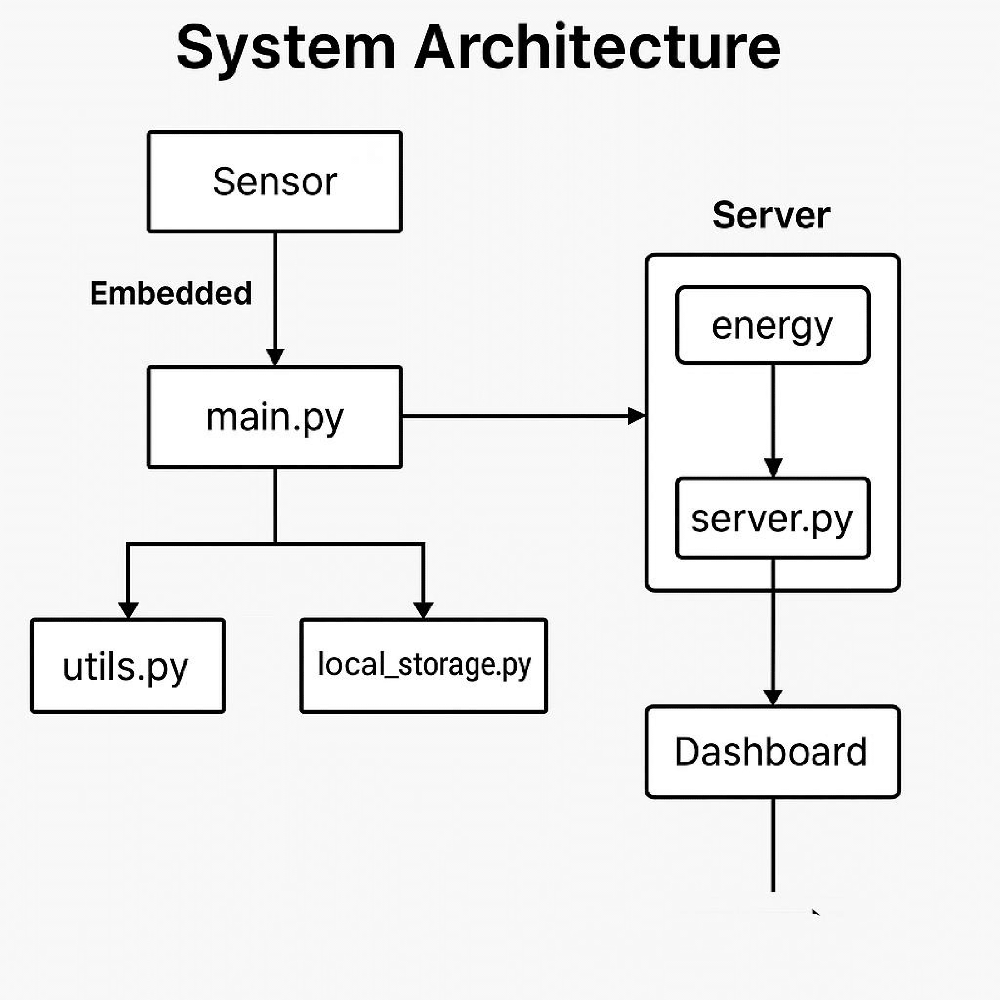
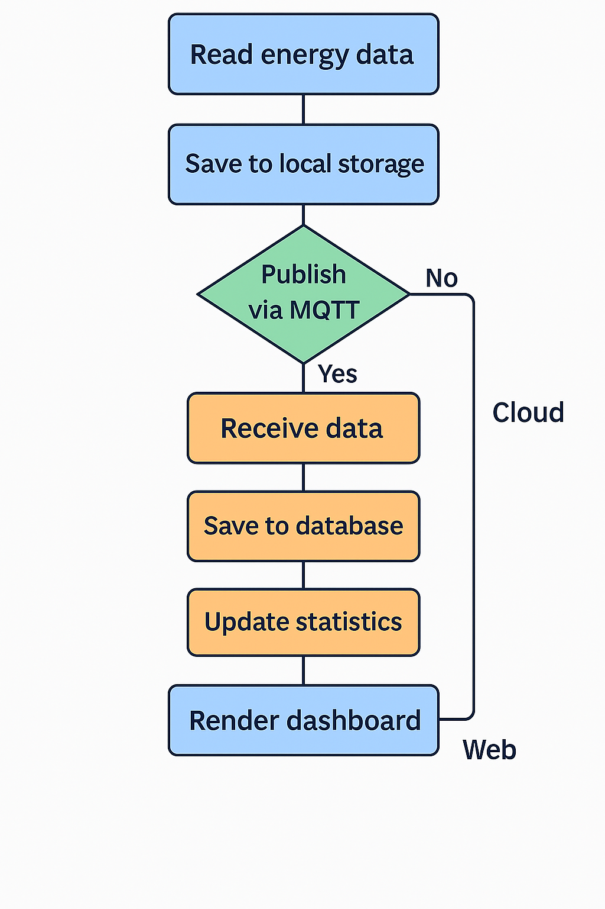

# Documentation

## Smart Home Energy Monitoring System
**Author**: Aditya Sabnis  
**Date**: April 11, 2025  
**Submission**: Real-time simulation of energy usage, local storage, and cloud dashboard  
**Tools**: Python, Flask, SQLite/CSV, FreeRTOS-style task scheduling

---

## Project Objective
To build a simulated smart embedded system that:

- Monitors energy usage of 3 appliances  
- Stores data locally  
- Sends data to a cloud server  
- Visualizes real-time energy statistics  

---

## Overview
This project simulates a **Smart Home Energy Monitoring System** using Python for embedded-like simulation and a Flask server for data visualization. Sensor readings are randomly generated (no physical ESP device is used). Data is logged locally and published via simulated MQTT to a server that stores, analyzes, and displays energy usage per device.

---

## Project Structure
```
📁 embedded/
├── main.py               # Simulates sensor data generation and MQTT communication
├── local_storage.py      # Handles local CSV logging
├── mqtt_client.py        # Simulates MQTT publish to server endpoint
└── utils.py              # Helper utilities for data generation

📁 server/
├── server.py             # Flask server to receive and display energy data
└── templates/
    └── dashboard.html    # Dashboard UI to visualize statistics

📁 data/logs/
├── sensor_log.csv        # Local CSV log of generated sensor data
└── comm_log.txt          # Log of communication and MQTT publishing

📁 docs/
├── architecture.pdf      # Architecture diagram of the system
├── schema.png            # Flowchart/system schema
└── report.md             # This documentation file

📁 demo/
└── demo.mp4              # (To be recorded) Walkthrough of the system in action
```

---

## System Components

### 1. Embedded Simulation
- **main.py**: Generates random power values for devices and sends data to server.
- **local_storage.py**: Logs data in `sensor_log.csv` for traceability.
- **mqtt_client.py**: Mimics MQTT behavior by sending POST requests to Flask server.
- **utils.py**: Generates device IDs, timestamps, and simulated power values.

### 2. Server & Visualization
- **server.py**: Flask server that receives POST data on `/energy`, stores in memory, and renders an HTML dashboard on `/dashboard`.
- **dashboard.html**: Renders a table of average, max, and min power usage by device.

### 3. Logs & Documentation
- **sensor_log.csv**: CSV log file of each generated reading.
- **comm_log.txt**: Logs all communication and errors.
- **schema.png**: System flowchart.
- **architecture.pdf/png**: High-level architecture diagram.

---

## Data Flow Summary

1. `main.py` generates synthetic readings per device every few seconds.
2. Each reading is:
   - Logged locally in `sensor_log.csv`
   - Sent via simulated MQTT (HTTP POST) to Flask server
3. Server receives and stores data in memory.
4. Visiting `/dashboard` shows aggregated power usage per device.

---

## Architecture Diagram


---

## System Schema (Flowchart)


---


## Simplified System Architecture
```
[ Simulated Sensors ]
       ↓
[ Task Scheduler ]
       ↓
[ Local Storage (CSV) ]
       ↓
[ HTTP POST (Client) ]
       ↓
[ Flask Cloud Server ]
       ↓
[ Dashboard (HTML) ]
```

---


## Technologies Used
- Python: Core programming  
- Flask: Cloud simulation  
- CSV Files: Lightweight local storage  
- Simulated Sensors: Randomized power readings

---

## Features Implemented
| Feature                     
|-----------------------------|
| 1.Real-time task simulation   | 
| 2.Sensor data generation      | 
| 3.Local CSV file logging      | 
| 4.Communication via HTTP      | 
| 5.Error handling + retries    | 
| 6.Flask server + dashboard    | 
| 7.Dashboard stats (avg/max)   | 

---

## Database Schema (CSV Format)
| Column Name | Description              |
|-------------|--------------------------|
| device_id   | Unique ID of appliance   |
| timestamp   | Date-time of reading     |
| power       | Power usage in watts     |

---

## Problems Faced & Solutions
| Problem                         | Solution                               |
|---------------------------------|----------------------------------------|
| Flask timeouts on large payloads| Reduced batch size                     |
| Local file write errors         | Added exception + logging mechanism    |
| Network simulation delays       | Used `time.sleep()` with retry logic   |
| Dashboard not updating dynamically | Used in-memory list + timestamp updates |

---


## How to Run

### Step 1: Start the Flask Server
```bash
cd server
python server.py
```
Visit: [http://localhost:5000/dashboard](http://localhost:5000/dashboard)

### Step 2: Simulate Sensor Data
Open a new terminal:
```bash
cd embedded
python main.py
```
You will see periodic readings being sent to the server and logged locally.

---

## Demo Recording (demo.mp4)
Record a short walkthrough showing:
- Running the server and embedded script
- Visiting the dashboard
- Live data updates

---

## Status
- Local simulation without ESP
- Local storage with CSV
- Flask server for data collection
- HTML dashboard with analytics
- Diagrams and documentation complete

---


## Sample Output
```
AC001,2025-04-10 12:02:00,1450.1
WM002,2025-04-10 12:02:00,700.4
FR003,2025-04-10 12:02:00,243.3
```

Access dashboard at: [http://localhost:5000/dashboard](http://localhost:5000/dashboard)

---

